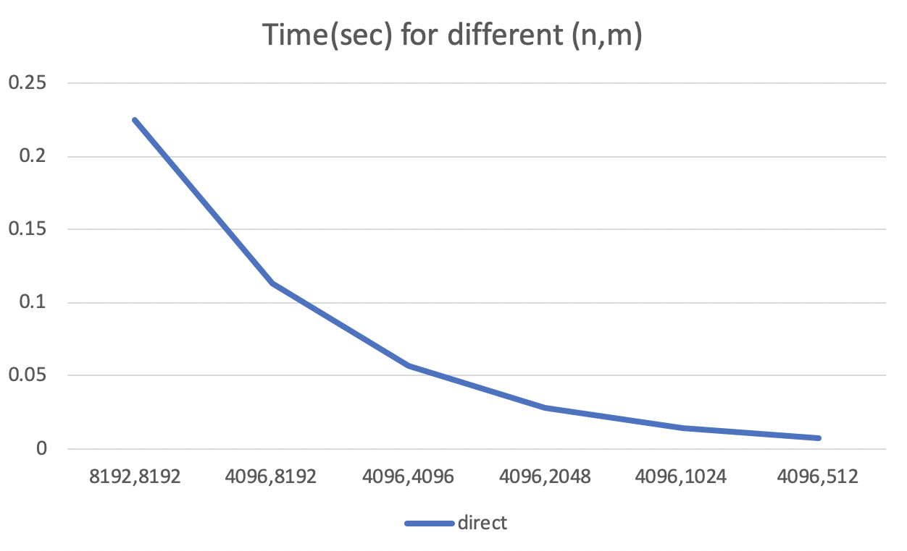

# 信号处理原理

## 双音频按键识别

### 实验目标

使用 MATLAB 实现 Goertzel 算法，对 DTMF 进行识别。

使用的 DTMF 音源来自 https://www.mediacollege.com/audio/tone/files/dtmf.zip ，用 ffmpeg 转换为 wav 后用于 MATLAB 程序使用。

### 实验过程

首先参考 MATLAB 上的文档对 “0” 这个音进行了 FFT：

```matlab
[sound, Fs] = audioread('dtmf-0.wav');
y = transpose(sound(:, 1)); % left

len = size(y);
len = len(2);
freq = fft(y);
t = Fs*(0:len-1)/len;
plot(t, abs(freq));
```

它的功能就是读出音频文件中的数据，得到两个声道的声音和采样频率，简单期间直接取了左声道。进行 FFT 后，把数字频率转换回模拟频率进行画图，得到了以下的图片：


可以看到，在九百多和一千三百多有两个峰，与理论上的 941Hz 和 1336 Hz 是吻合的。

接着，参考了[维基百科](https://en.wikipedia.org/wiki/Goertzel_algorithm)上进行实现，主要的公式如下：


与课件 PPT 上基本是一致的，然后我基本按照算法直接翻译为了 MATLAB 代码（见 my_goertzel.m）：

```matlab
function res = my_goertzel(data, Fs, freq)
    omega = freq / Fs * 2 * pi;
    vk2 = 0;
    vk1 = 0;
    vk = 0;
    y = 0;
    len = length(data);
    for i = 1:len
        vk = data(i) + 2 * cos(omega) * vk1 - vk2;
        vk2 = vk1;
        vk1 = vk;
        y = vk-vk1*exp(-1i*omega);
    end
    res = abs(exp(1i*omega)*vk-vk1);
end⏎
```

其中 vk，vk1，vk2, y 分别对应课件中对应的表示，只有最后的 res 赋值是按照维基百科的写法。

接着，简单地对所有可能的频率都调用一次 my_goertzel 函数，然后排序得到最大的两个频率就是结果了：

```matlab
f = [697, 770, 852, 941, 1209, 1336, 1477, 1633];
res = [];
for i = 1:length(f)
    val = my_goertzel(y, Fs, f(i));
    res = [res; [val, f(i)]];
end

res = sortrows(res, 1, 'descend');
ans1 = res(1,2)
ans2 = res(2,2)
```

结果截图（在 dtmf-1.wav 上运行）：


和理论是符合的。其他数字的声音也验证过，没有出现问题。

另一种方法是直接用内置的 FFT，然后取模拟频率对应的点上 DFT 的值，然后找到最大两个值对应的模拟频率就是我们要找的。也是用类似的方法，取出数据然后排序，得到结果：

```matlab
res2 = [];
for i = 1:length(f)
    val = freq(round(f(i)/Fs*len));
    res2 = [res2; [val, f(i)]];
end
res2 = sortrows(res2, 1, 'descend');
ans_fft1 = res2(1,2)
ans_fft2 = res2(2,2)
```

还是对 dtmf-1.wav 计算，可以看到两种方法得到的结果是一样的：


接下来对上面的代码进行计时，分别运行 100 次，得到总时间（cpu time）：


可见自己写的代码还是没有自带的 fft 快。MATLAB 有自带的 goertzel 算法的实现，肯定比自己写的更快，所以没有做更多的测试。

## 卷积计算性能比较

### 复杂度分析

一共有四个线卷积的算法：

1. 直接按公式计算，显然是 O(nm)
2. FFT 圆卷积计算，两次 FFT，一次 IFFT，和一次点乘，复杂度是 O((n+m)log(n+m))
3. Overlap Add，按块 FFT，块大小为 L，一共 n/L 块，所以复杂度是 O(n/L*(L+m)log(L+m))=O((n+m/L)log(L+m))
4. Overlap Save，按块 FFT，块大小为 N，一共 n/(N-m) 块，复杂度是 O(n/(N-m)*(N+m)log(N+m))

分别实现在 direct.m conv_fft.m overlap_add.m 和 overlap_save.m 中。其中 Overlap Add 基本按照维基百科上的伪代码实现， Overlap Save 则对维基百科上的伪代码进行了一些改动，按照 PPT 的图片实现以满足我们的要求。接着，我们对它进行性能测试，代码在 time.m 中。

性能测试时，采用的是同样的数据，先运行一次 assert 保证数据是正确的，然后用自带的 timeit 函数来衡量运行一次需要的时间。

| n    | m    | direct | fft    | o_a L=n | o_a L=n/16 | o_a L=n/256 | o_a L=n/4096 | o_s N=m | o_s N=m*2 | o_s N=m*3 | o_s N=m*4 |
| ---- | ---- | ------ | ------ | ------- | ---------- | ----------- | ------------ | ------- | --------- | --------- | --------- |
| 8192 | 8192 | 0.2245 | 0.0032 | 0.0034  | 0.0239     | 0.4373      | 5.1577       | 2.9264  | 0.0009    | 0.0008    | 0.0011    |
| 4096 | 8192 | 0.1129 | 0.0028 | 0.0029  | 0.0286     | 0.4060      | 0.9240       | 2.2239  | 0.0009    | 0.0008    | 0.0010    |
| 4096 | 4096 | 0.0566 | 0.0016 | 0.0018  | 0.0117     | 0.2138      | 0.4362       | 0.7226  | 0.0005    | 0.0004    | 0.0005    |
| 4096 | 2048 | 0.0283 | 0.0017 | 0.0018  | 0.0025     | 0.1049      | 0.2329       | 0.2796  | 0.0003    | 0.0004    | 0.0003    |
| 4096 | 1024 | 0.0142 | 0.0014 | 0.0015  | 0.0037     | 0.0489      | 0.1368       | 0.1407  | 0.0003    | 0.0003    | 0.0002    |
| 4096 | 512  | 0.0071 | 0.0010 | 0.0010  | 0.0010     | 0.0097      | 0.0865       | 0.0819  | 0.0003    | 0.0003    | 0.0002    |

针对 n=4096,m=4096 情况下各个算法画了下面的图：


由上图可见，direct 是比较慢的，因为复杂度比较高；FFT ， Overlap Add 和 Overlap Save 在采用合适的参数时都很快，但当 Overlap Add 中 L 太小（每次 FFT 只计算很少的几个数）和 Overlap Save 中 M 太小（每次 FFT 只取结果里的一个数）的时候，会出现退化的情况，块数过多，反而比 direct 还慢，做的 FFT 次数过多。但在参数选取地比较好的时候，例如 Overlap Save 在 M=[2m,4m]时，性能会比直接 fft 还要好。

针对 direct 算法，从数据中可以明显地看出符合 O(mn) 的时间关系：



对于 Overlap Add 算法，一个合适的 L 大小比较重要，我们对比了 L=n L=n/16 L=n/256 和 L=n/4096 的情况，在 m 比较大的时候，更大的 L 会带来更好的复杂度，因为 m/L 这一项比较小，log(L+m) 也不会很大，而 m 比较小的时候这个差别就不大了，这个趋势也在下面的图里得到了反映。


但实际上，当 L=n 的时候，会退化为直接用 FFT 的第二种算法，所以这种方法可能只有在 m 比较大的时候才能体现出它相当于 FFT 的优势。

对于 Overlap Save 算法，一个合适的 N 也很重要。Wikipedia 上写的推荐 N 区间是 [2m, 4m]，这个和实验数据也是比较符合的。当 N=m 时，每个 overlap 区间退化成了只有一个数是正确的结果，所以变成了最慢的一种。当 N 取 2m 3m 和 4m 的时候，跑得都非常快，比其他算法都快。这一点在 m 比较小的时候更有优势，因为 log(N+m) 会比 log(n+m) 小，前面的系数 (N+m)/(N-m) 也会更小。


总体结论：direct 复杂度高，比较慢，不要使用；FFT 比较快，并且是内置函数，使用方便；Overlap Add 需要选取合适的 L 值，在 L 值合适的时候和 FFT 速度差不多；Overlap Save 需要选取合适的 N 值，在 N 值合适的时候可能比 FFT 速度更快。

### 频分复用